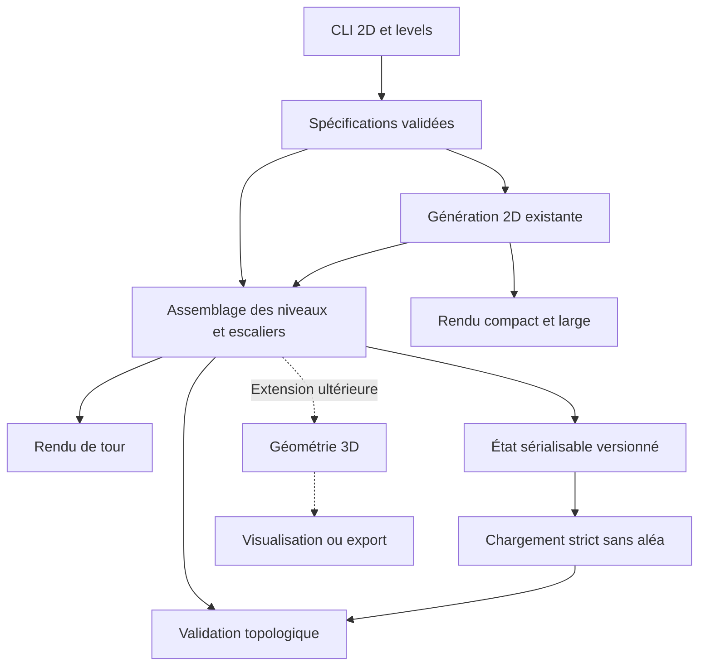

# Audit technique de perfect_maze — préparation des labyrinthes multi-niveaux

**Date :** 12 septembre 2026  
**Version de l’audit :** 1.0  
**Dépôt :** `michaellaunay/perfect_maze`  
**Révision examinée :** `73a57d1b22d89cb4af58509b9e9019a3461cf584`  
**Version déclarée du paquet :** `1.0.0`  
**Objet :** évaluer l’existant, confronter la conception multi-niveaux au code, identifier les risques et ordonner le développement.  
**Nature :** audit et recommandations ; aucune modification du dépôt distant.

## 1. Décision proposée

**Poursuivre le projet en conservant le moteur 2D, mais ouvrir le chantier par la consolidation des contrats du modèle et du rejeu.** Une réécriture générale ou l’introduction immédiate d’un moteur graphique ne sont pas justifiées par les défauts observés.

Le générateur 2D constitue une base crédible : code compact, absence de dépendance d’exécution, séparation modèle/rendu/CLI, Union-Find, fixtures historiques et tests de propriétés structurelles. Les essais supplémentaires effectués pendant cet audit n’ont trouvé aucune violation de la perfection dans les 1 000 configurations générées et rejouées. [S1, S4, S7, E1]

En revanche, plusieurs contrats deviennent fragiles dès que des données viennent de l’extérieur ou que l’on modifie le graphe : rejeu permissif, voisinages mutables pouvant devenir incohérents, historique de génération distinct de l’état courant. Il faut résoudre ces sujets avant qu’ils se propagent aux étages, aux escaliers et à la sauvegarde. [S1, E1]

La documentation multi-niveaux est une **bonne proposition de topologie**, pas encore une spécification d’implémentation fermée. Elle distingue correctement la perfection des étages de celle de l’ensemble, mais contient des erreurs numériques et laisse ouverts les contrats de coordonnées, de parcours, de valeurs par défaut et de reconstruction. Elle annonce explicitement que les tours ne sont pas encore implémentées. [S5, S6]

**Point de périmètre :** le projet documenté est une tour de labyrinthes 2D reliés verticalement, rendue en texte. Il ne comprend pas encore la spécification d’un affichage 3D graphique, d’un maillage, de collisions ou d’un export de modèle. Leur absence n’est donc pas un bug de l’implémentation actuelle. Ces capacités devront constituer un chantier distinct si elles sont visées. [S5, S6]

## 2. Méthode, preuves et limites

### 2.1 Ce qui a été examiné

L’audit s’appuie sur les sources Python du paquet, les quatre modules de tests, les README et pages de développement pertinents, les propositions multi-niveaux française et anglaise, le changelog, le packaging, la configuration documentaire et le workflow GitHub Actions. Les résultats et journaux du workflow associé au commit ont également été consultés. Les fixtures ont été considérées à travers leurs usages dans les tests ; cet audit ne prétend pas avoir relu individuellement chaque valeur de tirage historique. [S1–S10]

Le commit est fixé pour que les conclusions restent vérifiables même si `main` évolue. Ce rapport ne qualifie pas automatiquement une révision ultérieure.

### 2.2 Exécution indépendante

Sept fichiers Python ont été reconstitués localement depuis les réponses du connecteur GitHub. Leur contenu a été vérifié **octet pour octet par l’identifiant Git de blob**, calculé selon `SHA1("blob " + taille + NUL + contenu)`. Les sept identifiants correspondent aux blobs du commit. Il ne s’agit donc pas de versions approximatives du code. Le manifeste détaillé est fourni dans `evidence/source-integrity.json`.

Environnement des contrôles locaux : **Python 3.13.5, Linux x86-64**. Exécutions réalisées :

- 1 000 générations, sur 10 dimensions et 100 graines, avec contrôle de connexité, nombre d’arêtes, murs partagés, réciprocité, bordures et dimensions du rendu ; puis rejeu exact de chaque résultat ;
- neuf cas de rejeu invalide, manipulations de liens, distinction historique/état ;
- un test de lancement `python -m perfect_maze` ;
- microbenchmarks instrumentés, trois graines par dimension ;
- dénombrement exhaustif des 5 040 ordres d’arêtes d’une grille 2 × 3 pour examiner la distribution de Kruskal.

Les scripts et résultats sont fournis dans le dossier de preuves. Ils ne remplacent pas la suite de tests du projet et ne doivent pas être présentés comme 1 000 tests pytest. Une suite complémentaire de contrats a également été exécutée : **16 contrôles valides passent et 21 cas de non-régression échouent comme attendu** sur le code audité. Ces 21 cas déclinent les défauts de rejeu et de liens ; ce ne sont pas 21 causes indépendantes. Le résultat est conservé dans `evidence/regression-tests.txt`.

### 2.3 Résultats GitHub Actions

Workflow **34707832591**, sur le commit audité :

| Travail | Résultat observé |
|---|---|
| Lint et formatage | Réussite |
| Tests Python 3.12 | Réussite |
| Tests Python 3.13 | Réussite |
| Construction documentaire stricte | Réussite |
| Déploiement GitHub Pages | Échec |

Le journal du travail Python 3.13 indique **80 tests réussis**, une couverture totale de **99 %**, et Python **3.13.15**. Ce sont les résultats de la CI distante, et non ceux d’une réexécution locale de la suite complète. [S10, E4]

La couverture de `__main__.py` est affichée à 0 %, mais `test_python_dash_m` existe et lance ce module en sous-processus. Il s’agit ici d’une limite de collecte de couverture du sous-processus, pas de la preuve d’une absence de test. [S7]

### 2.4 Limites à conserver dans toute reprise de cet audit

Aucune exécution sous Python 3.14, Windows ou macOS n’a été réalisée dans cet environnement. Aucune scène 3D n’a pu être évaluée, puisqu’elle n’existe pas au commit audité. Il n’y a pas eu de test de charge sur la machine cible, ni de campagne exhaustive de fuzzing, ni de scan complet des vulnérabilités des dépendances de développement et de documentation. Les réglages administratifs de protection de branches et de GitHub Pages n’ont pas été vérifiés. Ce rapport n’est pas une certification de sécurité ou un avis juridique sur la licence.

## 3. État réel du produit

| Fonction | État au commit audité | Observation |
|---|---|---|
| Génération de labyrinthes parfaits 2D | Implémentée et testée | Base à conserver |
| Cellules et murs partagés | Implémentés | Construction initiale correcte ; mutation à fiabiliser |
| Rendu Unicode compact | Implémenté et testé | Pas d’intérieur de cellule disponible pour des marqueurs |
| Graine et rejeu de `open_walls` | Implémentés | Rejeu valide correct ; validation des entrées insuffisante |
| Enregistrement en fixture Python | Implémenté | Outil de diagnostic, pas encore format d’échange versionné |
| Tours avec dimensions et décalages variables | Conception seulement | Pas de module de tours dans le paquet |
| Escaliers U/D/B | Conception seulement | Contrats et source de vérité à fixer |
| Rendu large et aligné | Conception seulement | Extension compatible possible |
| Sous-commande `levels` | Conception seulement | Préserver la CLI 2D existante |
| Visualisation/maillage 3D | Non spécifié dans la proposition examinée | Chantier additionnel éventuel |

Sources : S1–S6, S8.

## 4. Registre des constats

**P1** : à traiter avant que l’extension ne dépende du contrat concerné, ou avant sa livraison publique. **P2** : consolidation à intégrer au chantier. **P3** : option ou amélioration non bloquante. Ces niveaux mesurent une priorité de développement, pas une sévérité CVSS.

| ID | Priorité | Nature | Constat | Critère de clôture principal |
|---|---|---|---|---|
| PM-01 | P1 | Défaut reproduit | Rejeu malformé accepté ou erreurs internes exposées | Validation complète, aucune donnée ignorée |
| PM-02 | P1 | Défaut reproduit | Rupture de réciprocité et de partage de mur après mutation | Liens cohérents ou mutation interdite explicitement |
| PM-03 | P1 | Spécification | Coordonnées, parcours et valeurs par défaut des tours ambigus | Contrats écrits et tests exécutables |
| PM-04 | P1 | Risque architectural | Plusieurs représentations modifiables du même graphe | Source canonique unique ; dérivations contrôlées |
| PM-05 | P1 | Sécurité CI | Permissions du jeton trop larges dans les travaux ordinaires | Lecture seule par défaut, élévation limitée |
| PM-06 | P1 livraison docs | Incident observé | Déploiement Pages en échec malgré une construction réussie | Déploiement et consultation du site réussis |
| PM-07 | P2 | Compatibilité documentée | Minimum setuptools incompatible avec les champs utilisés | Minimum cohérent et construction vérifiée |
| PM-08 | P2 | Conception de persistance | Fixture Python confondable avec sauvegarde durable | Format de données versionné et lecteur strict |
| PM-09 | P2 | Performance/robustesse | Génération à rejets sans borne déterministe de tentatives | Budget mesuré, stratégie de terminaison définie |
| PM-10 | P2 | Reproductibilité | Graine seule insuffisante comme contrat d’archivage | Algorithme/version/ordre explicites, état sauvegardé |
| PM-11 | P2 | Assurance qualité | Typage, wheel et matrice cible insuffisamment vérifiés | Tests du paquet installé et des API typées |
| PM-12 | P2 | Erreurs documentaires | Recouvrements, comptage des passages, esquisse API | Exemples corrigés et générés/vérifiés automatiquement |
| PM-13 | P2 | CLI/ressources | Limites et erreurs des futures entrées non définies | Tests non interactifs, EOF, limites et sorties |
| PM-14 | P3 | Choix de distribution | Kruskal n’est pas uniforme sur les arbres couvrants | Promesse documentaire exacte, autre algo seulement si requis |

Aucun problème de gravité critique immédiate n’a été démontré. En particulier, aucune exécution de code arbitraire via un lecteur de sauvegarde en production n’a été identifiée : ce lecteur n’existe pas.

## 5. PM-01 — Le rejeu doit devenir une reconstruction validée

**Localisation :** `src/perfect_maze/maze.py:348–371`. [S1]

Le code transforme `open_walls` en flux d’entiers avec `itertools.chain.from_iterable`, puis utilise ce flux comme une source `randrange`. Ce mécanisme est ingénieux pour les données produites par le générateur, mais il ne valide pas un document externe.

### 5.1 Défauts reproduits

```python
from perfect_maze import build_maze

# Coordonnée locale négative acceptée : -1 sélectionne la dernière colonne.
maze = build_maze(2, 1, open_walls=[(-1, 0, 3)])

# Suffixe invalide ignoré dès que le nombre de passages requis est atteint.
maze = build_maze(2, 1, open_walls=[(0, 0, 1), (999, 999, 99)])

# Deux enregistrements mal formés deviennent artificiellement un triplet.
maze = build_maze(2, 1, open_walls=[(0, 0), (1,)])
```

| Entrée | Résultat actuel |
|---|---|
| Aucun passage pour 2 × 1 | `StopIteration` |
| Triplet tronqué | `StopIteration` |
| Coordonnée `x=-1` | Acceptation silencieuse |
| Coordonnée `x=2` pour une largeur de 2 | `IndexError` |
| Bon arbre suivi de données invalides | Suffixe ignoré |
| Données invalides pour 1 × 1 | Données ignorées |
| Enregistrements `(0, 0)` et `(1,)` | Acceptés après aplatissement |
| Doublon suivi d’une séquence insuffisante | `StopIteration` |
| Mur extérieur seul | `StopIteration` |

Ces résultats ne remettent pas en cause les 1 000 allers-retours valides contrôlés. Ils montrent que l’API ne doit pas être utilisée comme validateur de fichier. [E1]

### 5.2 Correction recommandée

Distinguer le chemin de génération du chemin de reconstruction. La reconstruction doit examiner chaque enregistrement, sans le faire passer par un faux générateur aléatoire.

Pour un labyrinthe annoncé parfait, vérifier : dimensions entières positives ; triplets complets ; coordonnées locales dans les bornes ; direction valide ; existence d’un voisin intérieur ; unicité de chaque arête non orientée ; absence de cycle ; exactement `width * height - 1` passages ; connexité. Des invariants sont mathématiquement redondants, mais des diagnostics explicites restent utiles. La validation doit également refuser un suffixe superflu et les enregistrements non vides d’une grille 1 × 1.

La normalisation d’une arête doit identifier les deux descriptions équivalentes, par exemple l’est de `(0, 0)` et l’ouest de `(1, 0)`. Un simple test d’unicité des triplets ne suffit pas.

Renvoyer une erreur métier, par exemple `MazeFormatError(ValueError)`, avec l’indice de l’enregistrement et la cause. Préserver strictement les résultats des fixtures valides. Dans le nouveau lecteur de tours, ne jamais compléter aléatoirement un enregistrement incomplet.

**Tests de clôture :** chacun des neuf cas ci-dessus est rejeté proprement ; les fixtures historiques et les 1 000 allers-retours valides restent identiques.

## 6. PM-02 — Les liens entre cellules ne supportent pas correctement leur modification

**Localisation :** `maze.py:172–186`, et propriétés voisines. [S1]

```python
from perfect_maze import Cell

a, b = Cell(0), Cell(1)
a.east_cell = b
a.east_cell = None

assert b.west_cell is a           # Vrai, alors que a ne pointe plus vers b.

a.east_cell = b
assert a.east_wall is not b.west_wall  # Vrai : murs distincts.
assert a.east_wall.is_outer           # Vrai, malgré la présence du voisin b.
```

La déconnexion n’enlève pas l’ancien lien réciproque. La reconnexion suivante court-circuite la création du mur partagé parce que le voisin pointe encore vers la cellule. Le remplacement par un troisième voisin laisse également l’ancien voisin relié. [E1]

**Portée :** la construction normale de la grille ne rencontre pas ce scénario ; les tests sur les grilles fraîchement construites passent. Le risque apparaît dans une utilisation mutable de l’API, dans un éditeur ou dans des extensions qui reconstruisent les liens.

Deux stratégies sont acceptables. La première consiste à réserver les liaisons à la construction, puis rendre la topologie non modifiable par l’API publique. La seconde consiste à implémenter des opérations atomiques de liaison/déliaison qui réparent tous les anciens liens, leurs murs et leurs nouveaux partenaires. Pour une première version multi-niveaux génératrice, la première stratégie est plus simple.

Ne pas introduire brutalement une rupture de compatibilité de l’API 1.0.0 : documenter le contrat, puis choisir correction compatible ou dépréciation. Les tests doivent couvrir la répétition d’un lien, son retrait, son remplacement et sa restauration, dans les quatre directions.

## 7. PM-03/04 — Fermer les contrats multi-niveaux avant d’implémenter

### 7.1 Une identité de cellule non ambiguë

Une cellule doit être identifiable par `(niveau, x_local, y_local)`. Ses coordonnées dans la tour sont une transformation explicite, et non une autre interprétation du même triplet.

```text
CellRef(level, x, y)            : coordonnées locales
WorldPosition(level, X, Y)     : coordonnées de tour
X = origin_x[level] + x
Y = origin_y[level] + y
```

Des dataclasses nommées sont une possibilité, pas une obligation. L’essentiel est d’interdire le mélange silencieux de ces espaces. Les coordonnées globales peuvent être négatives, contrairement aux indices locaux valides. `Maze[-1, 0]` est actuellement un index Python valide ; ce choix doit être documenté ou une API stricte ajoutée avant de transposer l’accès aux tours. [S1, S5, E1]

`Tower.__getitem__` doit préciser cet espace, ainsi que le comportement des niveaux négatifs et des cellules hors limites. Les champs persistés doivent employer la même convention dans toutes les langues.

### 7.2 Parcours : adjacent ne signifie pas accessible

`Cell.neighbours()` retourne actuellement tous les voisins géométriques ; le README montre correctement qu’il faut filtrer par `cell.is_open(direction)`. L’esquisse `Tower.neighbours(level, cell)` ne précise pas si elle retourne les voisins accessibles ou tous les voisins. Cette ambiguïté peut rendre un solveur faux tout en donnant l’impression que la tour est connexe. [S1, S5, S8]

Je recommande de conserver l’API 2D et d’ajouter au niveau de la tour un contrat explicite, par exemple `passable_neighbours(ref)`. Il doit retourner les passages horizontaux ouverts et les escaliers effectivement présents, dans un ordre déterministe documenté. Le test de connexité doit utiliser ce même contrat public.

### 7.3 Escaliers et origines : une source de vérité

La proposition cumule une liste d’escaliers et des drapeaux `up`/`down` par cellule. Si ces valeurs sont modifiables indépendamment, on peut afficher un U sans passage réel, ou traverser un escalier invisible. [S5, S6]

Recommandation : rendre la liste normalisée des escaliers canonique, construire un index de parcours à partir d’elle et dériver les marqueurs. Une cellule B est alors simplement une cellule ayant les deux connexions verticales. Si des drapeaux sont conservés comme cache, ils ne doivent pas être librement modifiables et doivent être vérifiables par un validateur.

De même, les décalages relatifs constituent les données canoniques des spécifications ; les origines absolues sont calculées. Si le fichier contient les deux pour faciliter l’inspection, le lecteur doit rejeter leurs contradictions. Une dataclass `frozen=True` ne rend pas à elle seule immuables les objets `Maze` ou listes qu’elle contient.

### 7.4 Valeurs par défaut et entrées partielles

L’esquisse donne `LevelSpec.stairs = 0`, alors que tout étage supérieur doit avoir au moins un escalier et que l’interface interactive propose 1. Il faut normaliser explicitement le cas du rez-de-chaussée et celui des autres étages. Une solution simple est une valeur non renseignée distinguable, résolue en 0 pour le niveau 0 et en 1 au-dessus. Une autre est d’exiger le nombre d’escaliers dans l’API non interactive. [S5, S6]

Le constructeur de `LevelCell` n’initialise pas les slots `up`/`down` dans l’esquisse. C’est une lacune de pseudocode, pas un bug livré, mais elle doit disparaître de la spécification exécutable.

Définir aussi les cas suivants avant le développement : spécifications vides ; un seul étage ; premier étage portant un décalage ou des escaliers ; `stairs=None` contre `stairs=[]` ; rejeu complet contre mélange de génération et reconstruction ; nombre d’enregistrements de niveaux différent du nombre de spécifications. Les combinaisons non prises en charge doivent être rejetées, pas devinées.

## 8. PM-12 — Rectification mathématique et géométrique de la documentation

### 8.1 La distinction étage parfait / tour parfaite est juste

Notons `L` le nombre de niveaux, `N_i = w_i * h_i` le nombre de cellules d’un niveau, `N = Σ N_i` le nombre total de cellules, et `k_i` les escaliers entre les niveaux `i-1` et `i`.

Chaque niveau est un arbre et contient `N_i - 1` arêtes. Ainsi :

```text
E = Σ (N_i - 1) + Σ k_i
  = N - L + Σ k_i
```

Chaque niveau étant connexe et chaque paire successive ayant au moins un escalier, la tour est connexe. Son nombre de cycles indépendants est donc :

```text
μ = E - N + 1 = Σ (k_i - 1)
```

Par conséquent, `k_i = 1` pour toutes les paires donne un arbre global ; tout escalier supplémentaire crée un cycle indépendant. La proposition explique correctement ce choix délibéré. En revanche, son paragraphe de tests parle de « n - 1 passages au total » alors que `n` désigne le nombre de niveaux : il faut écrire **N - 1 passages au total**, et **L - 1 escaliers**. [S5, S6]

Une future option globalement parfaite ne peut pas fermer un mur horizontal arbitraire par escalier supplémentaire : elle doit supprimer une arête d’un cycle sans déconnecter le graphe. Elle modifierait les propriétés des niveaux et doit rester un mode explicitement distinct.

### 8.2 Recouvrements de l’exemple

Pour `8x5 6x4@1,1:2 4x3@-1,2:1` :

| Niveau | Taille | Origine absolue | Rectangle demi-ouvert |
|---|---|---|---|
| 0 | 8 × 5 | (0, 0) | [0, 8) × [0, 5) |
| 1 | 6 × 4 | (1, 1) | [1, 7) × [1, 5) |
| 2 | 4 × 3 | (0, 3) | [0, 4) × [3, 6) |

L’intersection 0/1 contient **6 × 4 = 24 cellules**, et l’intersection 1/2 **3 × 2 = 6 cellules**. Les maxima 15 et 8 affichés dans la session interactive de l’exemple sont donc incorrects. Les invites correspondantes doivent afficher `1-24` et `1-6`. Les versions française et anglaise doivent être corrigées ensemble. [S5, S6]

Cette tour contient 76 cellules et 76 passages, soit **un cycle indépendant**. Avec un seul escalier à chacune des deux interfaces, elle aurait 75 passages, dont deux escaliers.

### 8.3 Formules à transformer en tests

Pour deux rectangles de coins `(ax, ay)`, `(bx, by)` et dimensions `(aw, ah)`, `(bw, bh)` :

```text
xmin = max(ax, bx)          xmax = min(ax + aw, bx + bw)
ymin = max(ay, by)          ymax = min(ay + ah, by + bh)
area = max(0, xmax - xmin) * max(0, ymax - ymin)
```

Avec un décalage relatif `(dx, dy)` du second rectangle, il existe au moins une cellule commune exactement lorsque :

```text
1 - bw <= dx <= aw - 1
1 - bh <= dy <= ah - 1
```

Cette formule fournit les plages d’offset à présenter à l’utilisateur. Les tests doivent inclure les bornes inclusives, la séparation juste au-delà, les offsets négatifs et l’inclusion complète d’un niveau dans l’autre.

## 9. Architecture recommandée

L’extension peut rester petite. Il n’est pas nécessaire de créer un framework général de graphes en N dimensions.



Répartition possible :

| Module | Responsabilité |
|---|---|
| `maze.py` | Cellules, murs, génération et invariants 2D |
| `tower.py` | Spécifications normalisées, origines, escaliers, accès et parcours |
| `serialization.py` | Documents versionnés, lecture stricte, écriture |
| `render.py` | Compact, large et tour, ou sous-modules si la taille le justifie |
| `recorder.py` | Traces/fixtures de diagnostic historiques |
| `cli.py` | Analyse et interaction, sans logique de connexité |
| Futur adaptateur 3D | Traduction du graphe validé en géométrie, indépendante de la génération |

Les utilitaires de rectangle et de validation peuvent d’abord rester dans les modules qu’ils servent. Leur extraction n’a d’intérêt que si elle réduit réellement le couplage.

**Ne pas ajouter simplement UP/DOWN à l’énumération `Direction` existante.** Elle commande les quatre murs planaires, le tirage des directions et une table de coins à quatre bits. Les passages verticaux doivent avoir un modèle séparé, ou une nouvelle abstraction explicitement compatible. [S1, S2]

Conserver `cell_type` est utile, mais la tour ne doit pas dépendre de conversions de type non justifiées entre `Maze` et des cellules supposées `LevelCell`. Le type concret des cellules peut être conservé par une API générique, si l’usage le nécessite ; sinon, l’index d’escaliers externe évite ce couplage.

## 10. PM-08 — Une sauvegarde n’est ni une graine ni une fixture Python

**Localisation :** `recorder.py:19–57`. [S3]

L’enregistreur actuel produit des affectations Python, y compris tous les tirages rejetés. Il remplit correctement son rôle de création de fixtures. Les tests utilisent `exec` sur ces fichiers générés pendant le test. Cela ne démontre pas une vulnérabilité RCE de la CLI : aucun lecteur de fichier externe n’est livré. [S3, S7]

Pour les tours, introduire un format de données versionné — JSON convient sans ajouter de dépendance d’exécution — contenant au minimum le type de document, la version du schéma, les dimensions et offsets, les passages exacts de chaque niveau et les escaliers. La graine et l’identifiant de l’algorithme sont des métadonnées de provenance, non un substitut à cet état.

Exemple **proposé**, non pris en charge aujourd’hui :

```json
{
  "schema_version": 1,
  "kind": "tower",
  "generator": {"name": "kruskal-rejection", "version": 1, "seed": 7},
  "levels": [
    {"width": 2, "height": 1, "offset": [0, 0], "open_walls": [[0, 0, 1]]},
    {"width": 1, "height": 1, "offset": [1, 0], "open_walls": []}
  ],
  "stairs": [{"lower_level": 0, "world_x": 1, "world_y": 0}]
}
```

Le lecteur valide les tailles, les volumes de données, la perfection attendue des niveaux, l’unicité et le recouvrement des escaliers. Il rejette une version inconnue plutôt que d’en deviner le sens. Il ne fait aucun appel aléatoire et n’exécute pas de code provenant du fichier.

**Historique contre état courant.** Fermer manuellement un mur après génération ne modifie pas `Maze.open_walls`. Un rejeu de cet historique reproduit donc la génération initiale, pas nécessairement l’objet modifié. Le nom et la documentation actuels décrivent un historique ; ce n’est pas intrinsèquement une erreur. En revanche, une future sauvegarde d’édition doit extraire l’état réel, ou les mutations doivent être interdites. [S1, E1]

L’écriture actuelle écrase volontairement les fichiers existants ; ce comportement est documenté et testé. Pour le nouveau format, décider explicitement de la politique d’écrasement, puis écrire de manière atomique via un fichier temporaire dans le même répertoire et un remplacement. Ne pas casser silencieusement le comportement historique de `--output`. [S3, S7]

## 11. PM-09/10/14 — Performance et reproductibilité

### 11.1 Mesures du moteur actuel

Microbenchmarks Python 3.13.5, avec compteur d’appels aléatoires, trois graines 0, 1 et 42, sans rendu ni enregistrement dans le temps mesuré :

| Dimensions | Cellules | Temps médian observé | Tentatives / passage accepté, selon la graine |
|---|---:|---:|---:|
| 1 × 1 000 | 1 000 | 0,0574 s | 13,75–16,11 |
| 1 × 10 000 | 10 000 | 0,8049 s | 18,44–21,75 |
| 50 × 50 | 2 500 | 0,0776 s | 3,81–4,63 |
| 100 × 100 | 10 000 | 0,3577 s | 4,83–5,93 |

Ces chiffres décrivent un environnement d’audit, pas des garanties de performance sur la machine de l’utilisateur. Les tirages sont instrumentés, ce qui ajoute un coût. Les résultats détaillés figurent dans E1.

La structure Union-Find est appropriée. Le coût restant provient en partie des candidats rejetés : bordures, murs déjà ouverts ou cellules déjà dans la même composante. Dans un couloir 1 × n, tous les n−1 passages sont nécessaires ; chaque passage a une probabilité `1/(2n)` d’être proposé à chaque tentative. Le nombre moyen de tentatives suit donc `2n * H_(n-1)`, soit un comportement en `n log n`. Cette dérivation explique le surcoût mesuré des grilles étroites ; elle ne remet pas en cause l’amélioration apportée par Union-Find. [S1, S9, E1]

Une stratégie alternative est d’énumérer les `2wh - w - h` arêtes internes, de les mélanger puis de les traiter une seule fois par Union-Find. Elle borne le nombre de candidats et supprime les rejets de bordure. Elle consomme une liste supplémentaire et **change les sorties associées aux graines et les traces historiques**. La décision doit être conditionnée aux tailles cibles et accompagnée d’une version d’algorithme, pas glissée dans une correction discrète.

La fonction accepte aussi une source `randrange` injectable. Une source qui renvoie toujours un mur extérieur ne permet jamais de progresser. Aucun garde-fou ne l’arrête. Il faut documenter ce contrat et, selon le contexte d’exécution, prévoir une interruption/budget ; ce n’est pas une preuve que la génération avec `random.Random` se bloque normalement.

### 11.2 Taille des recouvrements et des traces

`Tower.overlap()` est esquissé comme une liste de toutes les coordonnées. Pour les grandes surfaces, un rectangle avec aire calculée et accès par indice évite cette matérialisation. La sélection sans remise des escaliers peut travailler sur des indices, avec un ordre de conversion déterministe. Le choix exact d’algorithme doit respecter l’injection de hasard prévue, plutôt que contourner celle-ci avec un RNG global caché. [S5]

Le mode d’enregistrement actuel conserve tous les tirages dans une liste, puis construit une chaîne contenant les tirages, passages et rendu. Il augmente donc la consommation mémoire. Il est raisonnable comme mode de diagnostic ; ce ne doit pas être le chemin obligatoire de sauvegarde d’une grande tour. [S3]

### 11.3 Définir la reproductibilité promise

La documentation Python ne garantit pas que toutes les méthodes et tous les algorithmes de génération restent identiques entre versions ; ses garanties de compatibilité ne signifient pas que toute utilisation future de `randrange` conservera la même sortie. [X2]

Pour perfect_maze, distinguer :

- **reproductibilité d’une génération** : mêmes spécifications, même graine, même version d’algorithme et même ordre d’appels ;
- **reconstruction d’une sauvegarde** : mêmes passages et escaliers, indépendante des tirages et des optimisations ultérieures.

Avec un RNG partagé entre les niveaux et les escaliers, changer l’ordre des étapes change toute la suite. Définir si tous les niveaux sont générés avant les escaliers, ou si les étapes sont entrelacées. Des flux indépendants par niveau/interface peuvent être utiles plus tard, mais ce n’est pas une exigence actuelle. Leur dérivation devrait être stable et ne pas reposer sur `hash()` de Python.

### 11.4 « Aléatoire » n’implique pas une distribution uniforme des labyrinthes

L’algorithme de Kruskal randomisé ne produit pas tous les arbres couvrants avec la même probabilité. Le dénombrement indépendant d’une grille 2 × 3 donne 15 arbres : six sont obtenus par 300 permutations d’arêtes, neuf par 360, sur 5 040 permutations ; une distribution uniforme donnerait 336 pour chacun. [E3]

Ce constat **n’est pas une violation de la documentation examinée** : celle-ci demande explicitement l’uniformité du placement des escaliers, pas celle de tous les labyrinthes. Ne changer d’algorithme pour ce motif que si une exigence statistique apparaît.

## 12. Rendu et utilisabilité

Le rendu compact utilise bien tout son espace ; le style large est donc une bonne décision pour U/D/B. Conserver ses fixtures actuelles évite de transformer l’ajout des tours en régression du produit 2D. [S2, S5, S7]

Pour une largeur intérieure `c`, le dessin large doit faire `(c + 1) * w + 1` colonnes et `2h + 1` lignes. Avec `c=3`, les facteurs d’alignement sont quatre colonnes et deux lignes par cellule. Si `c=1` est autorisé, le facteur horizontal devient deux : il ne faut pas conserver un décalage codé en dur à quatre. L’esquisse de `printable_maze` doit exposer ou fixer clairement la largeur intérieure ; celle de `printable_tower` l’expose déjà. [S5, S6]

La correspondance entre U et D se vérifie dans les coordonnées du canevas aligné propre à chaque étage, hors titre. Ce n’est pas une égalité des numéros absolus de ligne dans la sortie complète, puisque les dessins sont imprimés successivement.

Limiter initialement les marqueurs à U/D/B et à un caractère occupant une colonne simplifie le contrat. Un crochet général `cell_char` devra refuser ou traiter les retours à la ligne, séquences de contrôle et caractères de largeur terminal incompatible. Tester les bordures, les cellules B et les offsets négatifs, ainsi que les deux valeurs d’alignement.

Pour les grandes tours, l’alignement ajoute des marges et lignes vides. Définir une limite de rendu ou proposer `--no-align`/sélection de niveau, plutôt que produire sans contrôle une sortie immense. Ces limites sont une politique à choisir, pas des constantes à inventer dans cet audit.

## 13. PM-05/06 — CI et publication documentaire

### 13.1 Réduire les permissions

Le workflow ne fixe pas de permissions minimales au niveau global ; le journal du travail de tests sur push montre de nombreuses autorisations d’écriture, notamment sur le contenu et les Actions. Elles ne sont pas nécessaires à un test ou à une construction documentaire. [S4, E4]

Recommandation : `permissions: {contents: read}` au niveau du workflow, puis conserver l’élévation `pages: write` et `id-token: write` uniquement dans le travail de déploiement. Ajouter `persist-credentials: false` au checkout lorsque les étapes suivantes ne doivent pas écrire. Les Actions sont référencées par tags majeurs ; leur fixation par SHA complet est une mesure complémentaire de maîtrise de la chaîne d’approvisionnement. Ces principes correspondent aux recommandations de GitHub. [X3]

Les dépendances de CI non contraintes rendent les exécutions variables dans le temps. Conserver des contraintes ou un verrou de l’environnement de développement/documentation, avec une procédure d’actualisation. Cela ne nécessite pas de verrouiller rigidement les métadonnées de la bibliothèque pour tous ses consommateurs.

Le workflow utilise `pull_request`, pas un montage manifestement dangereux de code de PR non fiable sous `pull_request_target`. Aucun exploit n’a été démontré. La disponibilité ou l’absence de protections de branche ne peut pas être déduite du seul fichier YAML.

### 13.2 Distinguer le build du déploiement

Dans le travail `deploy-docs` 103591053496, l’artefact documentaire est trouvé, mais la création du déploiement Pages échoue en HTTP 404. Le message conseille de vérifier l’activation de Pages. [S10, E4]

La correction consiste d’abord à vérifier le réglage Pages du dépôt, sa source de déploiement GitHub Actions et les éventuelles restrictions d’environnement. **Il ne faut pas conclure que Zensical ne construit pas la documentation : son travail réussit.** L’absence d’activation de Pages est une hypothèse plausible, pas un réglage que l’audit a pu inspecter.

Les avertissements Node 20/24 présents dans les journaux sont un sujet de maintenance des Actions ; ils ne constituent pas l’explication démontrée du 404. Après correction des réglages, valider un déploiement réel et les pages FR/EN. Ajouter une stratégie de concurrence des déploiements est utile si plusieurs pushes rapprochés deviennent fréquents.

## 14. PM-07/11 — Packaging, dépendances et compatibilité

### 14.1 Minimum setuptools à corriger

`pyproject.toml` accepte `setuptools>=69` tout en utilisant une expression SPDX dans `project.license` et `project.license-files`. Le support de ces champs a été introduit dans setuptools **77.0.0**. La borne minimale déclarée est donc incohérente. [S4, X1]

Correction minimale proposée :

```toml
[build-system]
requires = ["setuptools>=77.0.0"]
build-backend = "setuptools.build_meta"
```

Une installation actuelle peut réussir parce qu’elle sélectionne une version récente ; c’est précisément ce qui s’est produit dans la CI. Le défaut concerne la promesse de compatibilité avec les versions anciennes autorisées. Tester ensuite une construction avec la borne minimale réellement retenue et une avec la chaîne habituelle.

### 14.2 Inventaire des dépendances

| Groupe | Déclaration dans le projet | Évaluation |
|---|---|---|
| Exécution | Aucune dépendance externe | Atout à préserver pour le noyau et les tours textuelles |
| Construction | setuptools >= 69 | Minimum à relever |
| Développement | pytest >= 8 ; pytest-cov >= 5 ; ruff >= 0.5 | Fonctionnent dans la CI observée ; environnement non figé |
| Documentation | zensical >= 0.0.61 ; mkdocstrings[python] >= 1.0 | Construction stricte réussie dans la CI observée |
| Publication | Guide utilisant `build` et `twine` | Installation de ces outils non incluse dans les extras montrés |

Les versions résolues relevées dans le travail de tests comprennent pytest 9.1.1, pytest-cov 7.1.0, coverage 7.16.0 et ruff 0.16.7. Elles décrivent ce travail précis, **pas une recommandation aveugle de dernière version pour tous les environnements**. Les versions résolues de tous les composants documentaires n’ont pas été inventoriées dans les preuves conservées. [S4, S10, E4]

Documenter l’installation des outils de publication ou ajouter un groupe dédié. Avant une diffusion, construire wheel et sdist, vérifier les métadonnées, la licence, `py.typed`, le point d’entrée et l’installation hors du checkout. Le simple `pip install -e` des tests ne couvre pas ces cas. [S4, S8]

### 14.3 Python, typage et plateformes

Le paquet exige Python >= 3.12 ; le code utilise effectivement la syntaxe de typage correspondante. La CI vérifie 3.12 et 3.13. Aucune incompatibilité 3.14 n’a été démontrée, mais le support 3.14 n’est pas validé par cette matrice ni par les exécutions locales de cet audit. Ajouter Python 3.14 et n’annoncer ce support qu’après passage effectif des tests. Les variantes free-threaded, le parallélisme et les garanties entre threads ne sont pas évalués. [S1, S4]

Le marqueur `py.typed` et les annotations sont positifs, mais Ruff ne vérifie pas la cohérence complète des types. Un exemple de consommation de `cell_type` perd actuellement le type spécialisé dans la valeur de retour déclarée `Maze`. L’esquisse de tour suppose pourtant des `LevelCell`. Ajouter un travail de vérification des types du paquet et de petits programmes clients qui utilisent les cellules spécialisées. [S1, S4, S5]

Un test minimal Windows/macOS est cohérent avec le classificateur « OS Independent », notamment pour les chemins de sortie et l’affichage Unicode. L’absence de ces travaux ne prouve pas une incompatibilité ; elle indique une couverture non démontrée.

La licence déclarée est AGPL-3.0-or-later. Les choix de diffusion et d’intégration doivent rester cohérents avec cette licence ; cet audit n’en déduit pas automatiquement un régime juridique applicable à chaque labyrinthe généré. [S4, S8]

## 15. PM-13 — CLI, validation et limites de ressources

La CLI 2D actuelle est simple, avec validation des dimensions positives et gestion des erreurs d’écriture `OSError`. Elle doit continuer à accepter les commandes existantes sans sous-commande. [S3, S4, S7]

Pour `levels`, définir précisément la grammaire `WIDTHxHEIGHT[@DX,DY][:STAIRS]`, les valeurs par défaut, le traitement des signes, l’ordre des options et les messages d’erreur. La génération ne doit commencer qu’après validation de l’ensemble des niveaux, comme le prévoit déjà la documentation. [S5]

Dans la bibliothèque, décider comment traiter les booléens à la place d’entiers : `True` est actuellement accepté comme dimension 1. Il s’agit d’une question de validation du contrat, pas d’une erreur de génération d’une grille valide. Le lecteur de données et la CLI de tours devraient appliquer une politique stricte et uniforme.

Prévoir des tests de non-interactivité sans paramètres, d’EOF pendant une invite, d’interruption clavier et de sortie vers un flux fermé. Les cas non pris en charge doivent terminer avec un code documenté, sans boucle d’invites infinie. Séparer diagnostics sur stderr et résultat sur stdout.

Avant d’exposer la génération dans un service, fixer un budget sur le nombre total de cellules, le nombre de niveaux, le nombre d’escaliers, le volume du fichier et la taille du rendu. Aujourd’hui, le produit est une bibliothèque/CLI locale ; aucune attaque contre un service public n’a été démontrée. Ces limites deviennent nécessaires si des entrées distantes non fiables sont ajoutées.

## 16. Stratégie de tests cible

| Domaine | Cas requis avant livraison |
|---|---|
| Régression 2D | Fixtures de tirages, murs et rendu compact inchangées |
| Rejeu invalide | Bornes, triplets, directions, doublons inverses, suffixes, cycle et déconnexion |
| Modèle mutable ou figé | Contrat des liens répétés, supprimés, remplacés et restaurés |
| Tours minimales | Un niveau ; niveaux 1 × 1 ; cellules B ; interfaces d’une seule cellule |
| Géométrie | Offsets négatifs/positifs ; inclusion ; séparation ; origine cumulative |
| Escaliers | Cardinalité exacte ; absence de doublon ; bornes ; réciprocité ; même position globale |
| Graphe | Chaque étage parfait ; tour connexe ; `E=N-L+Σk` ; `μ=Σ(k-1)` |
| Reproductibilité | Même configuration/graine/version ; ordre déterministe ; historique versionné |
| Sauvegarde | Aller-retour de l’état ; rejet de versions inconnues ; aucun appel RNG au chargement |
| Rendu | Dimensions ; marqueurs U/D/B ; largeur intérieure 1/3 ; compact inchangé ; alignement |
| CLI | Syntaxe historique ; `levels` ; invites ; non-TTY ; EOF ; erreurs d’écriture |
| Distribution | Wheel/sdist ; installation propre ; commande console ; `python -m` ; `py.typed` |

Les tests de structure actuels sont pertinents. Les compléter par des cas générés sur plusieurs dimensions, offsets et graines, éventuellement avec un outil de tests génératifs dans les dépendances de développement seulement. Ne pas faire de la couverture de lignes l’unique critère d’acceptation. [S7]

Ajouter un seuil explicite de couverture évite une baisse silencieuse, mais doit être accompagné des tests de contrats ci-dessus. La cible précise est un choix d’équipe ; le 99 % actuel ne prouve pas l’absence des défauts reproduits.

## 17. Feuille de route recommandée, par changements relisibles

| Lot / message de commit indicatif | Contenu | Conditions de sortie |
|---|---|---|
| A — `docs: clarify tower contracts and correct examples` | Coordonnées, défauts, parcours, graphe, recouvrements, portée de la 3D | Contrats et exemples FR/EN cohérents ; cas d’acceptation chiffrés |
| B — `fix: validate maze replay and preserve graph invariants` | PM-01 et stratégie PM-02 ; historique contre état | Cas invalides rejetés ; fixtures et contrôles valides inchangés |
| C — `ci: harden permissions and validate distributions` | Permissions ; Pages ; setuptools ; wheel ; types ; Python cible | CI verte, distribution installable, documentation consultable |
| D — `feat: add wide maze rendering` | Largeur et marqueurs ; compact préservé | Fixtures 2D compactes identiques et rendu large testé |
| E — `feat: add validated multilevel towers` | Spécifications, origines, recouvrement, escaliers, parcours | Propriétés de graphe et géométrie validées ; aucun besoin de CLI |
| F — `feat: add versioned tower persistence` | Sérialisation de l’état et lecteur strict ; fixture historique séparée | Aller-retour exact ; chargement sans aléa ; fichiers invalides rejetés |
| G — `feat: expose aligned towers in the CLI` | Rendu de tour, `levels`, invites et non-interactivité | Tous les scénarios documentés exécutables et CLI 2D conservée |
| H — `docs: document and release multilevel support` | Tutoriels FR/EN, migration, limites, changelog | Recette complète depuis un environnement vierge |

Les lots A/B/C préparent les fondations. D peut avancer indépendamment de l’assemblage des tours. E précède F et G ; F doit être défini avant de figer l’option d’enregistrement de G. H ne remplace pas les tests de recette.

Le plan initial en cinq patchs est utile, mais il regroupe trop de décisions dans le constructeur et dans la CLI/enregistrement. L’ordre proposé réduit les conflits et permet de tester les tours sans interface utilisateur. Il ne suppose pas de changer l’algorithme de génération ni d’ajouter un moteur graphique. [S5, S6]

La version mineure 1.1.0 envisagée dans la documentation convient à une extension compatible ; une rupture de contrat public ou de promesse de graine doit être signalée et traitée suivant la politique de versionnement choisie, pas masquée par un simple ajout de fonctionnalités. [S9]

## 18. Recette de la première livraison multi-niveaux

La livraison ne doit pas être qualifiée de prête uniquement parce qu’une tour s’affiche. Elle est prête lorsque la commande d’exemple produit trois niveaux aux bonnes origines, exactement deux puis un escalier, avec 76 cellules, 76 passages et un cycle indépendant ; lorsque la sauvegarde recharge le même état sans aléa ; lorsque les données invalides sont rejetées ; et lorsque la CLI historique et les fixtures 2D restent inchangées.

La documentation doit explicitement dire que les étages sont parfaits et que la tour peut contenir des cycles. Un mode globalement parfait ne doit pas être promis au-delà du cas d’un escalier par interface tant qu’un autre algorithme n’est pas spécifié et testé.

Une éventuelle livraison graphique 3D aura sa propre recette : hauteur des étages, dimensions de cellules, géométrie des ouvertures, représentation des escaliers et des cellules B, maillages, caméra et interaction. Aucun de ces critères ne doit être confondu avec la connexité du graphe.

## 19. Conclusion

**Le projet mérite l’effort de développement prévu ; le bon investissement initial est la précision des contrats, pas une réécriture.** Les résultats observés soutiennent le maintien du noyau 2D. Les défauts de rejeu et de mutation sont suffisamment concrets pour justifier des corrections immédiates avant leur réutilisation. La proposition de tours est mathématiquement viable et proche d’une spécification implémentable, à condition de corriger ses exemples et d’arrêter les décisions d’API et de persistance.

Priorité pratique : **validation du rejeu → invariants du graphe → contrats des tours → état sauvegardable → intégration CLI/rendu**, avec remise en état de la CI documentaire et durcissement de ses permissions en parallèle.

## 20. Références et dossier de preuves

Les références de fichiers ci-dessous sont des permaliens au commit audité. Les numéros de ligne mentionnés dans le corps correspondent au fichier source, pas aux enveloppes JSON du connecteur.

- **S1 — Modèle et génération :** `https://github.com/michaellaunay/perfect_maze/blob/73a57d1b22d89cb4af58509b9e9019a3461cf584/src/perfect_maze/maze.py`
- **S2 — Rendu :** `https://github.com/michaellaunay/perfect_maze/blob/73a57d1b22d89cb4af58509b9e9019a3461cf584/src/perfect_maze/render.py`
- **S3 — CLI et enregistrement :** mêmes permaliens, chemins `src/perfect_maze/cli.py` et `src/perfect_maze/recorder.py`.
- **S4 — Packaging et CI :** mêmes permaliens, chemins `pyproject.toml` et `.github/workflows/ci.yml`.
- **S5 — Conception française :** `https://github.com/michaellaunay/perfect_maze/blob/73a57d1b22d89cb4af58509b9e9019a3461cf584/docs/fr/multilevel.md`
- **S6 — Conception anglaise :** même permalien, chemin `docs/en/multilevel.md`.
- **S7 — Tests :** mêmes permaliens, chemins `tests/test_build_maze.py`, `tests/test_cli.py`, `tests/test_recorder.py`, `tests/test_render.py`.
- **S8 — Utilisation et développement :** mêmes permaliens, chemins `README.fr.md`, `docs/fr/development.md`, `mkdocs.yml`.
- **S9 — Changelog :** même permalien, chemin `CHANGELOG.md`.
- **S10 — Exécution CI :** `https://github.com/michaellaunay/perfect_maze/actions/runs/34707832591` ; travaux de tests 103591007334 et 103591007378, déploiement 103591053496.
- **X1 — Setuptools, configuration pyproject, prise en charge des champs de licence :** `https://setuptools.pypa.io/en/latest/userguide/pyproject_config.html`, consulté le 12 septembre 2026.
- **X2 — Python, module random, notes sur la reproductibilité :** `https://docs.python.org/3/library/random.html`, consulté le 12 septembre 2026.
- **X3 — GitHub, utilisation sûre des Actions, permissions et immuabilité des références :** `https://docs.github.com/en/actions/reference/security/secure-use`, consulté le 12 septembre 2026.

**E1 :** `evidence/probes.json` et `probe_perfectmaze.py` — observations locales et campagne de contrôles.  
**E2 :** `evidence/source-integrity.json` et `evidence/cli-smoke.json` — intégrité des sources et lancement du module.  
**E3 :** `evidence/kruskal-distribution.json` et `enumerate_kruskal.py` — dénombrement indépendant.  
**E4 :** `evidence/ci-observations.json` — transcription structurée des observations sélectionnées dans les journaux distants, non archive brute de ces journaux.  
**E5 :** `tests_audit_regression.py` — cas de non-régression proposés, volontairement en échec sur les contrats défectueux de la version auditée.
